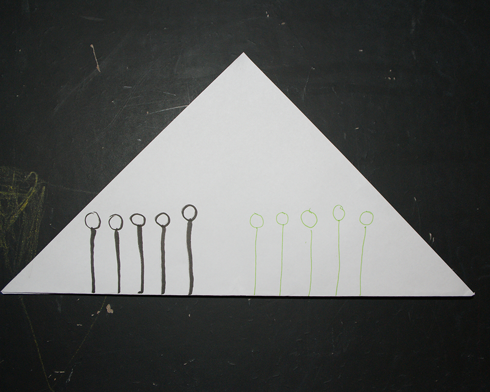
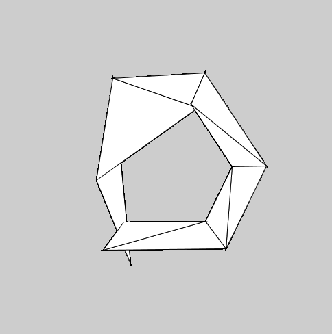
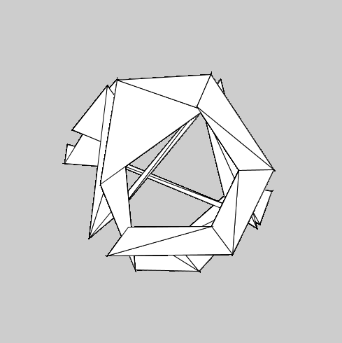
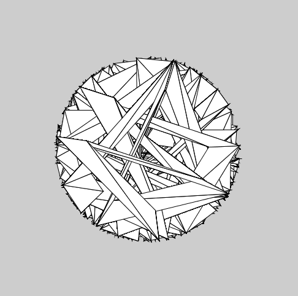
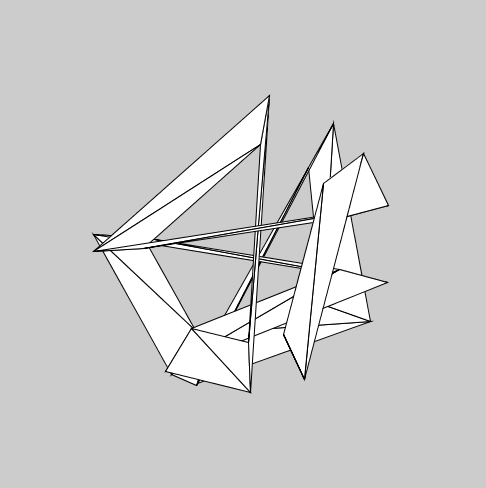
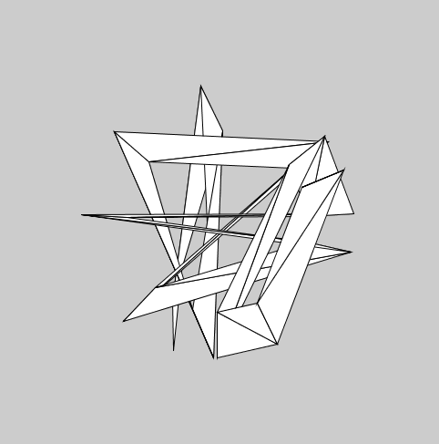
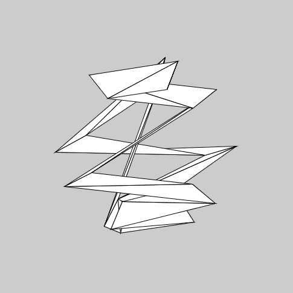

# triangle algorithm

From analog to digtial algorithm. Our first exercise was to create a precise written drawing instruction, so that 10 people could implement it. Afterwards we analyzed the results, to improve the instructions and to try out different parameters. Finally we translated our concept in to a digital format by using Processing in python mode. This little project could be used as tool to design indivual jewelry or icons.
#analog algorithm
#1

#####material
A4 paper sheet, pencils(no matter what color)
#####instructions
- put the papersheet in horizontally front of you and
pick out one pencil, with whom you will draw the following instructions


- startin from the left top corner of the sheet, draw a wormed line 


- stop drawing this line when reaching the center of the sheet
- starting now from the center of the sheet, draw a jagged line in the 4 corners of the sheet

- stop drawing
####the result

#2
####material
white paper triangle,colored pencils (green, black)	
####instructions

1.to execute the following instructions you have 5min.

2.the trangle lies in front of you

3.the rectangle corner of the triangle is on the top, the base should be horizontally in front of you

4.pick out the black pencil

5.start from the triangles left side

6.every time you have to begin from the base to draw 5 vertical lines as long as your thumb

7.after drawing the 5th line, by using the same pencil, put on top of each line a circle

8.afterwards use the green pencil instead of the black

9.repeat successively step 6. and 7. starting from the right side of the triangle

10.stop drawing

#3
####material
grey cardboard triangel, colored pencils(red, green,yellow,blue,white)
####instructions
1.put the triangle in front of you, so that the rectangular corner points to the top

2.pick out the white pencil an draw in each corner a cricle of a random size

3.hatch the circles with your favorite color

4.define with a point the center of each circle

5.to get a new triangle,link the centers by using the white pencil again

6.crosshatch the new triangle with the pencil you like least

7.in the new triangle, you repeat in the same order, step 2 to 6 until there is no space for circles
 


####the result


#digital algorithm


#triangle stripe
You can easily change the parameters angle and angleStep in both codes.
##you'll need
- [Processing 2.2.1](https://processing.org/)
- [Python Mode for Processing](https://github.com/jdf/processing.py)

Be sure to switch to the python mode, when you execute the given codes in Processing.

##triangle in circle
   
```python
wdth=500
hght=500
x1=100
y1=100
x2=250
y2=350
x3=450
y3=100
outsideRadius = 150
insideRadius = 100

c=color(int(random(0,255)),int(random(0,255)),int(random(0,255)),50)

def setup():
    size(wdth,hght)
    background(205)
    x = wdth / 2
    y = hght / 2

def draw() :
 
    numPoints = int(map(mouseX, 0, width, 6, 60))
    angle = 109
    angleStep = 360.0 / numPoints

    beginShape(TRIANGLE_STRIP)
    for i in range(numPoints):
        x = width / 2
        y = height / 2
        px = x + cos(radians(angle)) * outsideRadius
        py = y + sin(radians(angle)) * outsideRadius
        angle += angleStep
        vertex(px, py)
        px = x + cos(radians(angle)) * insideRadius
        py = y + sin(radians(angle)) * insideRadius
        vertex(px, py)
        angle *= angleStep*100
    endShape()

def mousePressed():
    redraw()
```


##triangle stripes
   
```python
outsideRadius = 150
insideRadius = 100

def setup():
    size(500, 500)
    background(204)
    x = width / 2
    y = height / 2

def draw():
    background(204)
    
    numPoints = int(map(mouseX, 0, width, 6, 60))
    angle = 109
    angleStep = 360.0 / numPoints

    beginShape(TRIANGLE_STRIP)
    for i in range(numPoints):
        x = width / 2
        y = height / 2
        px = x + cos(radians(angle)) * outsideRadius
        py = y + sin(radians(angle)) * outsideRadius
        angle += angleStep
        vertex(px, py)
        px = x + cos(radians(angle)) * insideRadius
        py = y + sin(radians(angle)) * insideRadius
        vertex(px, py)
        angle *= angleStep*100
    endShape()
```

###License

The MIT License (MIT)

Copyright (c) 2015 Rosaplankton

Permission is hereby granted, free of charge, to any person obtaining a copy
of this software and associated documentation files (the "Software"), to deal
in the Software without restriction, including without limitation the rights
to use, copy, modify, merge, publish, distribute, sublicense, and/or sell
copies of the Software, and to permit persons to whom the Software is
furnished to do so, subject to the following conditions:

The above copyright notice and this permission notice shall be included in
all copies or substantial portions of the Software.

THE SOFTWARE IS PROVIDED "AS IS", WITHOUT WARRANTY OF ANY KIND, EXPRESS OR
IMPLIED, INCLUDING BUT NOT LIMITED TO THE WARRANTIES OF MERCHANTABILITY,
FITNESS FOR A PARTICULAR PURPOSE AND NONINFRINGEMENT. IN NO EVENT SHALL THE
AUTHORS OR COPYRIGHT HOLDERS BE LIABLE FOR ANY CLAIM, DAMAGES OR OTHER
LIABILITY, WHETHER IN AN ACTION OF CONTRACT, TORT OR OTHERWISE, ARISING FROM,
OUT OF OR IN CONNECTION WITH THE SOFTWARE OR THE USE OR OTHER DEALINGS IN
THE SOFTWARE.
